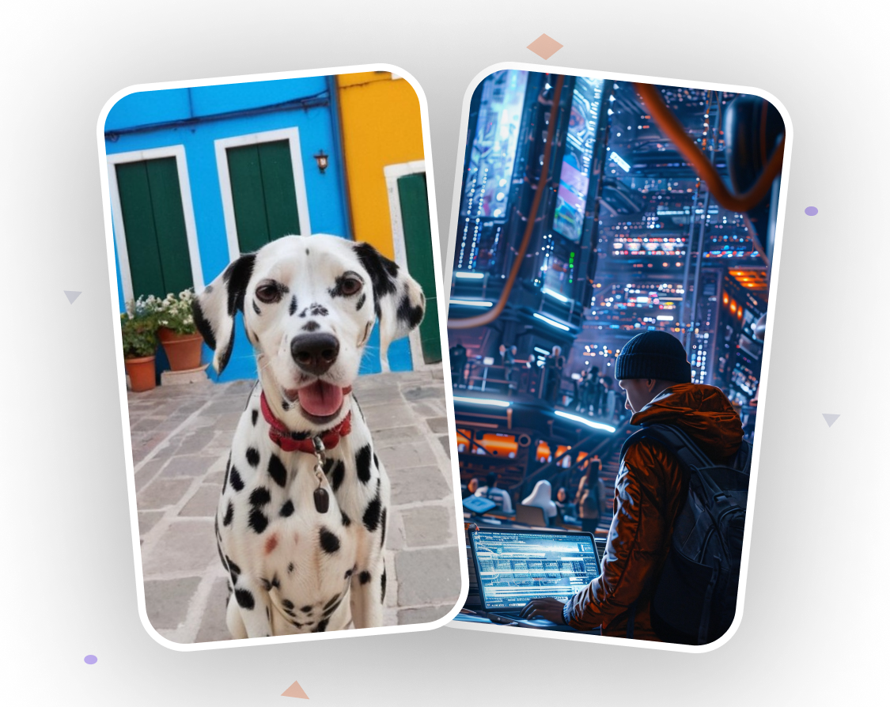

<div align="center">
  <br />
  <h3>
    <font size="20">
        Aora - A Social Media App for AI Enthusiasts
    </font>
  </h3>
  <br />
  <div>
    
    
  </div>
  <br />
  <div>
    
    
    
  </div>
</div>

## 📋 Table of Contents

1. 🤖 [Introduction](#introduction)
2. ⚙️ [Tech Stack](#tech-stack)
3. 🔋 [Features](#features)
4. 🤸 [Quick Start](#quick-start)

## 🤖 Introduction

Built with React Native for seamless user experiences, Animatable for captivating animations, and integrated with the dependable backend systems of Appwrite, this app showcases impressive design and functionality, enabling seamless sharing of AI videos within the community.

## ⚙️ Tech Stack

- React Native
- Expo
- Nativewind
- Animatable
- Appwrite

## 🔋 Features

- **Onboarding Screen**: Engaging graphics and clear instructions welcome users to the app.
- **Robust Authentication & Authorization System**: Secure email login safeguards user accounts.
- **Dynamic Home Screen with Animated Flat List**: Smoothly animated flat list showcases the latest videos for seamless browsing.
- **Pull-to-Refresh Functionality**: Users can refresh content with a simple pull gesture for up-to-date information.
- **Full-Text Search Capability**: Efficiently search through videos with real-time suggestions and instant results.
- **Tab Navigation**: Navigate between sections like Home, Search, and Profile with ease using tab navigation.
- **Post Creation Screen for Uploading Media**: Upload video and image posts directly from the app with integrated media selection.
- **Profile Screen with Detailed Insights**: View account details and activity, including uploaded videos and follower count, for a personalized experience.
- **Responsiveness**: Smooth performance and adaptability across various devices and screen sizes for a consistent user experience.
- **Animations**: Dynamic animations using the Animatable library to enhance user interaction and engagement throughout the app's UI.

...and many more, including code architecture and reusability.

## 🤸 Quick Start

Follow these steps to set up the project locally on your machine.

### Prerequisites

Make sure you have the following installed on your machine:

- [Git](https://git-scm.com/)
- [Node.js](https://nodejs.org/en)
- [npm](https://www.npmjs.com/) (Node Package Manager)

### Cloning the Repository

```bash
git clone https://github.com/aasn0119/aora.git
cd aora
```

**Installation**

Install the project dependencies using npm:

```bash
npm install
```

**Running the Project**

```bash
npm start
```

**Expo Go**

Download the [Expo Go](https://expo.dev/go) app onto your device, then use it to scan the QR code from Terminal and run.

<hr />

## Note 📝:

- Contributions are welcome! Feel free to open an issue or submit a pull request if you have any suggestions or improvements to the project.
- If you liked the project, don't forget to give it a star ⭐!
- For more information, check out the [Contributing Guidelines](CONTRIBUTING.md).
